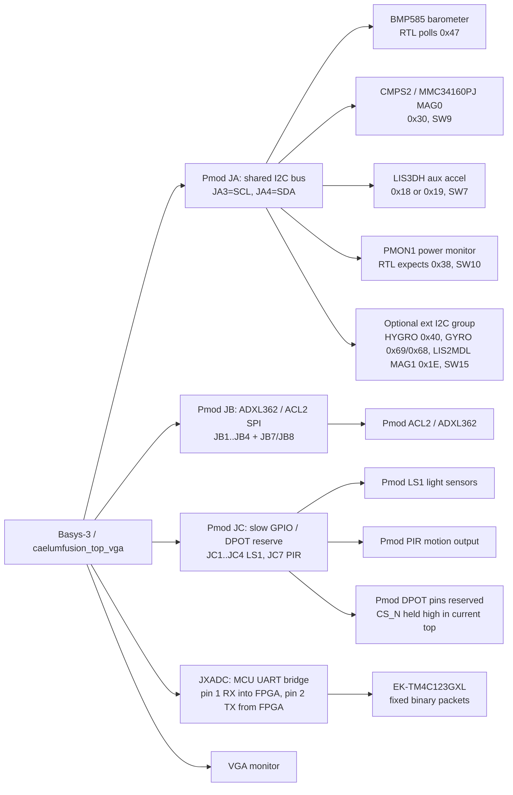
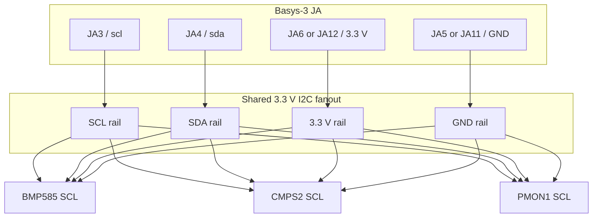
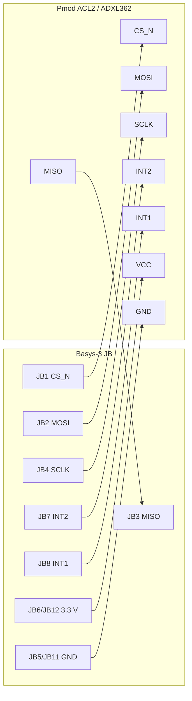
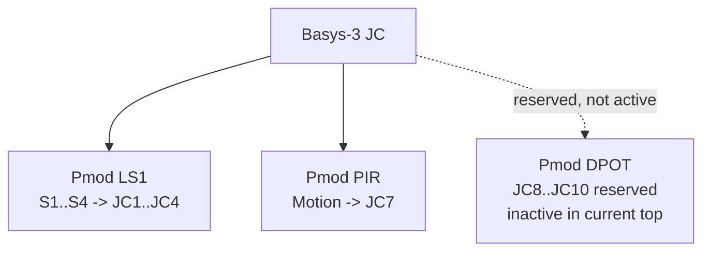

# CaelumFusion Basys-3 Pmod Wiring Guide

This guide records the wiring contract for the active `caelumfusion_top_vga`
Basys-3 build. It is intentionally tied to the current XDC and top-level port
list, not to a generic Pmod example design.

This guide is for the default non-`CAELUM_SENSOR_SPI` build. The source keeps a
legacy SPI-build branch behind that Verilog define, but the canonical XDC used
here constrains the default shared-I2C sensor bus plus the dedicated ADXL362 SPI
header. Do not define `CAELUM_SENSOR_SPI` unless you also provide and verify the
matching SPI-build pin constraints.

The current physical allocation is:

| Basys-3 connector | Current role | Status |
|---|---|---|
| JA | Shared I2C sensor bus | Active |
| JB | Pmod ACL2 / ADXL362 SPI accelerometer | Active |
| JC | LS1/PIR slow GPIO plus DPOT-reserved pins | Active GPIO, DPOT held inactive |
| JD | Not present on Basys-3 canonical XDC | Do not plan wiring here |
| JXADC | External MCU fixed-packet UART bridge, currently EK-TM4C123GXL UART1 | Pins assigned, bridge default-off |

The Basys-3 Pmod banks are 3.3 V LVCMOS. Do not connect 5 V sensor signals to
these pins. Power down the Basys-3 before changing wiring, keep a common ground
between all boards, and verify the Pmod pin-1 orientation from the silkscreen on
both boards before applying power.

## System Wiring Overview



## Standard Pmod Header Orientation

Use this numbering convention when reading the tables below. This is the
logical Pmod pin numbering, not the FPGA package pin number.

```text
Pmod header viewed from the connector/silkscreen side

   top row:     1     2     3     4     5(GND)  6(3V3)
   bottom row:  7     8     9    10    11(GND) 12(3V3)
```

Always trust the board silkscreen if a particular Pmod shows pin 1 differently
from your cable orientation. A reversed Pmod cable can put 3.3 V or ground onto
an FPGA I/O signal.

## JXADC: EK-TM4C123GXL UART Bridge

The Basys-3 board does not provide a normal `JD` Pmod header in this project
pinout. The clean remaining connector for the first external-MCU bridge is
`JXADC`, used here as 3.3 V digital I/O. The top-level bridge is compiled
default-off with the historical `USE_TEENSY_UART_RANGE_BRIDGE = 0` generic;
when deliberately enabled, SW15 gates accepted UART range evidence into
`sensor_extension_hub.rng_*`.

Confirmed in the current XDC:

| Basys connector pin | FPGA package pin | RTL signal | Direction | Expected behavior | Verification step |
|---|---:|---|---|---|---|
| JXADC pin 1 / XA1_P | J3 | `teensy_uart_rx_raw` | TM4C PC5/U1TX/J4.05 -> FPGA input | 3.3 V 8N1 UART, idle high, pulled up in XDC | With FPGA disconnected, confirm PC5 idle high; after wiring, decode `A5 5A` frame sync |
| JXADC pin 2 / XA2_P | L3 | `teensy_uart_tx` | FPGA output -> optional TM4C PC4/U1RX/J4.04 | 3.3 V UART line, currently held idle high for future ACK/debug | Leave disconnected for first pass; confirm steady high after configuration before wiring to TM4C RX |
| JXADC pin 5 or 11 | board GND | common ground | Shared reference | Basys and LaunchPad grounds tied | Continuity check with power off |
| JXADC pin 6 or 12 | board 3.3 V | optional reference only | Do not backfeed | Do not power the LaunchPad from Basys unless the full power plan allows it | Voltage check before connecting any power rail |

Do not connect any 5 V UART source to `teensy_uart_rx_raw`. In particular, the
EK-TM4C123GXL J3.01 5.0 V header pin is not a signal pin and must not touch the
FPGA. Keep the bridge at 3.3 V logic end to end. Power both boards down before
wiring TX/RX/GND, and verify that TM4C TX goes to Basys RX. A same-name TX-to-TX
wiring mistake will not work and may create output contention if both sides
drive.

UART was chosen over SPI for this first transport because it uses only two
signal pins, can be passively decoded by WaveForms, and is sufficient for low
rate range/GNSS evidence. SPI remains a future option for higher-rate optical
flow or bulk diagnostic traffic.

Use `docs/CaelumFusion_TM4C123GXL_UART_Bridge_Bringup.md` for the exact
LaunchPad producer, WaveForms UART decoder, and first FPGA-connected validation
sequence.

## JA: Shared I2C Sensor Bus

JA carries the project-wide I2C sensor bus. All I2C sensors must share the same
four electrical nets: SCL, SDA, 3.3 V, and GND. Mechanically, the Basys-3 has
only one JA connector, so multiple I2C Pmods require a Pmod splitter, a small
3.3 V breadboard fanout, or individual jumper wires.

| Basys JA pin | FPGA package pin | Current signal | Wire to I2C devices |
|---|---:|---|---|
| JA1 | J1 | Unused by active top | Leave open |
| JA2 | L2 | Unused by active top | Leave open |
| JA3 | J2 | `scl` | SCL on every I2C sensor |
| JA4 | G2 | `sda` | SDA on every I2C sensor |
| JA5 | board GND | GND | GND on every sensor |
| JA6 | board 3.3 V | 3V3 | VCC/3V3 on every sensor |
| JA7 | H1 | Unused by active top | Leave open |
| JA8 | K2 | Unused by active top | Leave open |
| JA9 | H2 | Unused by active top | Leave open |
| JA10 | G3 | Unused by active top | Leave open |
| JA11 | board GND | GND | Optional second GND |
| JA12 | board 3.3 V | 3V3 | Optional second 3V3 |

### JA I2C Bus Diagram



The active RTL assumes the I2C master does not use clock stretching. SCL is
driven as an open-drain-style output from the FPGA side, and SDA is
bidirectional for ACK and read-data sampling. Start with short wires and only
one or two devices, then add devices one at a time.

### Current JA I2C Device Plan

| Device | Project role | Expected 7-bit address | Runtime control | Wiring status |
|---|---|---:|---|---|
| BMP585 | Primary pressure/temperature source | `0x47` in current RTL | Always scheduled by the sensor suite | Wire to JA fanout |
| Pmod CMPS2 / MMC34160PJ | MAG0 field vector and planar heading source | `0x30` | SW9 | Wire to JA fanout |
| LIS3DH aux accelerometer | Auxiliary I2C acceleration evidence | `0x18` or `0x19` | SW7 | Wire to JA fanout if fitted |
| Pmod PMON1 | Rail voltage/current telemetry | `0x38` expected by RTL | SW10 | Wire to JA fanout after address check |
| Pmod HYGRO / HDC1080 | Humidity/environment evidence | `0x40` | SW15 extension group | Wire only after base bus is stable |
| Pmod GYRO / L3G4200D | Gyro/IMU evidence | `0x69`, fallback `0x68` | SW15 extension group | Wire only after base bus is stable |
| LIS2MDL MAG1 | Redundant magnetometer evidence | `0x1E` | SW15 extension group when compiled | Validation path; wire only after MAG0 and PMON1 are stable |

The default `caelumfusion_top_vga` bitstream now includes the PMON1 hardware
path. SW10 still gates live PMON1 bus requests/publication, so leave SW10 low
until the board address and measurement-terminal wiring have been checked.

Physical LIS2MDL/MAG1 is a deliberate redundant-magnetometer validation path,
compiled by `USE_LIS2MDL_MAG1` and runtime-gated by SW15. Keep SW15 low and do
not wire the sensor until MAG0, PMON1, shared-bus pullups, and the `0x1E`
address have been validated. Synthetic MAG1 is separately SW3-gated and must
remain visibly tagged as bench evidence when enabled.

For PMON1, check its address jumpers or solder configuration before relying on
the design. The current RTL expects address `0x38`; a board configured to a
different address will look like a missing or faulted power sensor.

PMON1 does not require new Basys-3 FPGA pins because its I2C pins share JA SCL
and SDA. Its measurement terminals are separate from the Pmod I2C header and
must be wired according to the PMON1 reference manual and the bench power plan.
Use this runtime contract for validation: SW10 low means intentionally
unavailable/stale, SW10 high with a valid PMON1 means sequence/age/status update,
and SW10 high with PMON1 unplugged means invalid I2C error evidence rather than
stale-good power data.

## JB: Pmod ACL2 / ADXL362 SPI

JB is dedicated to the SPI accelerometer path. In this project, Pmod ACL2 is the
ADXL362-based accelerometer. Do not share JB with another SPI device unless a
new chip-select and XDC contract are added.

| Basys JB pin | FPGA package pin | RTL signal | Wire to Pmod ACL2 |
|---|---:|---|---|
| JB1 | A14 | `adxl362_cs_n` | ACL2 J1 pin 1 / CS_N |
| JB2 | A16 | `adxl362_mosi` | ACL2 J1 pin 2 / MOSI |
| JB3 | B15 | `adxl362_miso` | ACL2 J1 pin 3 / MISO |
| JB4 | B16 | `adxl362_sclk` | ACL2 J1 pin 4 / SCLK |
| JB5 | board GND | GND | ACL2 GND |
| JB6 | board 3.3 V | 3V3 | ACL2 VCC |
| JB7 | A15 | `adxl362_int2` | ACL2 J1 pin 7 / INT2 |
| JB8 | A17 | `adxl362_int1` | ACL2 J1 pin 8 / INT1 |
| JB9 | C15 | Unused by active top | Leave open |
| JB10 | C16 | Unused by active top | Leave open |
| JB11 | board GND | GND | Optional second GND |
| JB12 | board 3.3 V | 3V3 | Optional second 3V3 |

Enable this path with SW8. The interrupt pins are asynchronous board inputs and
are synchronized inside the sensor suite before use.



## JC: LS1, PIR, and DPOT-Reserved Pins

JC is the slow GPIO and bench-control connector. The current top captures LS1
and PIR evidence. DPOT pins are constrained and driven to a safe inactive state
in the current top; the digital potentiometer is not yet an active command path.

| Basys JC pin | FPGA package pin | RTL signal | Intended connection |
|---|---:|---|---|
| JC1 | K17 | `ls1_s_raw[0]` | Pmod LS1 S1 output |
| JC2 | M18 | `ls1_s_raw[1]` | Pmod LS1 S2 output |
| JC3 | N17 | `ls1_s_raw[2]` | Pmod LS1 S3 output |
| JC4 | P18 | `ls1_s_raw[3]` | Pmod LS1 S4 output |
| JC5 | board GND | GND | LS1/PIR/DPOT GND |
| JC6 | board 3.3 V | 3V3 | LS1/PIR/DPOT VCC |
| JC7 | L17 | `pir_motion_raw` | Pmod PIR motion output |
| JC8 | M19 | `dpot_cs_n` | DPOT CS_N, held high in current top |
| JC9 | P17 | `dpot_mosi` | DPOT MOSI, held low in current top |
| JC10 | R18 | `dpot_sclk` | DPOT SCLK, held low in current top |
| JC11 | board GND | GND | Optional second GND |
| JC12 | board 3.3 V | 3V3 | Optional second 3V3 |

Because LS1, PIR, and DPOT are separate boards, they usually cannot all be
plugged into JC mechanically at the same time. Use a small breakout or jumper
fanout if you want LS1 and PIR simultaneously. Keep the DPOT disconnected until
there is an explicit command-authority path for it.



## MAXSONAR / Rangefinder Status

The current RTL has an internal `rng_*` evidence scaffold in the extension hub
and visualization bundle. The canonical top-level XDC now assigns a default-off
JXADC UART transport for external-MCU range packets, but it does not assign a
native FPGA MAXSONAR, lidar, echo, trigger, or PWM pin yet.

Do not connect Pmod MAXSONAR to JA/JB/JC in the current bitstream:

| Rangefinder option | Current recommendation |
|---|---|
| MAXSONAR PWM pulse width | Future FPGA-native input after adding a named top-level pin, synchronizer, edge timer, and XDC constraint. |
| MAXSONAR UART | Route through the external-MCU bridge first; the FPGA receives decoded fixed packets, not raw sensor text. |
| Analog range output | Do not use Basys-3 Pmod GPIO directly; it needs a proper ADC/XADC contract and voltage-range review. |
| I2C lidar/rangefinder | Can share JA only after address, voltage, pullup, and scheduler effects are reviewed. |

The active range evidence contract is `rng_payload[47:32]` for height in cm,
`rng_payload[31:16]` for confidence, `rng_status`, `rng_age_ms`, and
`rng_seq`, matching the existing extension hub naming. Until a real physical
range sensor and MCU packet producer exist, range should remain synthetic or
deterministic replay evidence only.

## External MCU Bridge Status

`teensy_bridge_packet_ingress.v` now defines the SYS-domain fixed-packet
contract for external-MCU bridge evidence. The module keeps its historical name
to avoid HDL interface churn. It verifies packet checksum, packet type,
sequence, timestamp, heartbeat freshness, and range/AGL payload validity before
publishing `rng_*` evidence. `teensy_uart_range_bridge.v` is the first physical
transport wrapper and receives those packets over 3.3 V 8N1 UART.

The bridge pins are assigned on JXADC, not JD. Keep the bridge default-off until
the exact TM4C UART producer has been flashed and the idle levels have been
verified with WaveForms. Do not wire any signal beyond JXADC pin 1, JXADC pin 2,
and common ground for this first bring-up pass. Leave JXADC pin 2 disconnected
until receive-only evidence on JXADC pin 1 is clean.

Initial fixed packet types:

| Packet type | Value | Meaning |
|---|---:|---|
| `PKT_TEENSY_HEARTBEAT` | `0x50` | Bridge liveness and sequence evidence |
| `PKT_TEENSY_RANGE_AGL` | `0x51` | Rangefinder/lidar AGL evidence |

The external MCU side should own GNSS parsing, lidar/range sensor drivers, SD
logging, radio protocols, packet sequence generation, and checksum generation.
The FPGA side should receive decoded evidence packets only; it should not
receive NMEA sentences, filesystem traffic, or radio framing bytes as sensor
evidence.

## Runtime Controls For Wiring Bring-Up

The switches do not change pin assignments; they gate logic that is already in
the bitstream. Use these controls while adding hardware one device at a time.

| Board control | Current role |
|---|---|
| BTNC | Global reset |
| BTNU | Next visualization page |
| BTND | Previous visualization page |
| BTNR | Direct-select latch: encoded SW13:SW11 view ID when SW3 and SW2+SW6 fault injection are inactive; fixed compass request only in builds with encoded selection disabled |
| BTNL | Intentionally unused because the physical button is missing |
| SW0 | Arm/status gate |
| SW1 | Policy-enable/status gate |
| SW2 | Self-test HUD hold and synthetic extension diagnostic evidence |
| SW3 | Synthetic/bench MAG1 source enable |
| SW4 | Compass/MAG evidence page hold |
| SW5 | Freeze history/trails |
| SW6 | Black-box/log diagnostics enable; with SW2 high, deliberate diagnostic fault injection |
| SW7 | LIS3DH I2C accelerometer enable; with SW2+SW6, selects ACC fault bank |
| SW8 | ADXL362/ACL2 SPI accelerometer enable; with SW2+SW6, selects ACC fault bank |
| SW9 | CMPS2/MMC34160PJ MAG0 enable; with SW2+SW6, selects MAG fault bank |
| SW10 | PMON1 power telemetry enable; with SW2+SW6, selects PWR fault bank |
| SW11 | Apply MAG1 bench X offset when SW3 is high; with SW2+SW6, fault-class bit 0; otherwise encoded direct-view bit 0 |
| SW12 | Apply MAG1 bench Y offset when SW3 is high; with SW2+SW6, fault-class bit 1; otherwise encoded direct-view bit 1 |
| SW13 | Apply MAG1 bench Z offset when SW3 is high; with SW2+SW6, fault-class bit 2; otherwise encoded direct-view bit 2 |
| SW14 | Compass/MAG evidence default/hold companion |
| SW15 | Optional shared-I2C extension group enable |

## Recommended Bring-Up Sequence

Use `docs/CaelumFusion_Discovery3_Basys3_Pmod_Instrumentation_Guide.md` as the
bench instrumentation gate for the WaveForms checks in this sequence.

1. Power the Basys-3 with no Pmods attached and verify that VGA syncs.
2. Hold SW2 high and confirm deterministic self-test/diagnostic evidence. Then
   add SW6 to confirm the deliberate fault path changes status without changing
   wiring. With SW2+SW6 high, SW10 selects PWR, SW9 selects MAG, SW7/SW8 select
   ACC, and no selector switch selects BMP; SW11-SW13 select the fault class.
3. Attach only the JA I2C fanout wiring for GND, 3.3 V, SCL, and SDA.
4. Add BMP585 and CMPS2 first. Turn on SW9 and inspect the compass evidence
   page. For encoded direct navigation, clear SW3 and clear either SW2 or SW6,
   set SW13:SW11 to `001`, and press BTNR; alternatively use SW4 as the
   compass hold. Heading remains planar `atan2(MY, MX)`, not tilt-compensated.
5. Add PMON1 next. Turn on SW10 and check voltage/current status, age, sequence,
   and I2C error behavior. Then unplug or disable PMON1 while SW10 remains high
   and confirm the PWR bank reports invalid I2C error evidence instead of
   retaining stale-good voltage/current data.
6. Add LIS3DH if needed. Turn on SW7 and verify that it appears as auxiliary
   acceleration evidence, not as a replacement for the ADXL362 path.
7. Add optional extension I2C devices one at a time under SW15: HYGRO first,
   then GYRO, then LIS2MDL/MAG1. If the bus fails, remove the last device and
   check address, pullups, and wiring orientation.
8. Attach Pmod ACL2 to JB. Turn on SW8 and verify ADXL362 status, age, sequence,
   and acceleration response.
9. Attach LS1 and PIR to JC only through a verified pin breakout. Confirm LS1
   bits and PIR event count before attaching any DPOT wiring.
10. Leave DPOT disconnected until a command-authority and fault-injection plan is
   explicitly implemented.
10. Leave MAXSONAR disconnected from the FPGA until the rangefinder physical pin
    contract is added to `caelumfusion_top_vga` and the XDC.

## I2C Fanout Checklist

Before applying power to a multi-device I2C bus:

| Check | Expected result |
|---|---|
| Common ground | Every sensor GND is tied to Basys JA5 or JA11 |
| Supply voltage | Every sensor VCC is tied to Basys 3.3 V, not 5 V |
| SCL continuity | JA3 reaches every sensor SCL pin |
| SDA continuity | JA4 reaches every sensor SDA pin |
| Unique addresses | No two devices answer at the same 7-bit address |
| Pullups | Bus has pullups, but not so many parallel pullups that edges become overly strong |
| Wire length | Keep early bring-up wiring short; expand only after stable ACKs |
| Switch gate | Only enable the device group currently being tested |

## Validation Points

Use the display as an engineering instrument during wiring:

| Evidence | What to check |
|---|---|
| Valid/status badge | Device should move from missing/stale to valid after enable |
| Age | Age should reset or stay bounded at the device cadence |
| Sequence | Sequence should advance deterministically and not jump unexpectedly |
| I2C error count | Should remain stable after initial bring-up |
| MAG0/MAG1 delta | Should be small only when both sensors are physically plausible and similarly oriented |
| Synthetic MAG1 label | SW3 bench data must never be mistaken for flight-validated MAG1 |
| History freeze | SW5 should freeze display history without changing sensor acquisition |
| Page selection | BTNU/BTND/BTNR/SW4/SW14 should change only the rendered page, not sensor ownership; BTNR encoded selection is intentionally rejected while SW3 MAG1 bench or SW2+SW6 fault injection owns SW11:SW13 |

## Current Limitations

- The shared I2C bus is physically one Basys-3 Pmod connector; multiple I2C
  Pmods require a splitter or external wiring.
- The current heading publication remains planar `atan2(MY, MX)`. Redundant
  magnetometer evidence is displayed separately and is not fused into heading.
- DPOT pins are reserved but inactive in the canonical top.
- MAXSONAR/rangefinder physical pins are not assigned yet.
- SD logging is not FPGA-filesystem-owned; logging should remain external-MCU or host
  owned unless a dedicated stream interface is added.

## Files That Define This Contract

| File | Role |
|---|---|
| `CaelumFusion_Flight_Control_System.srcs/constrs_1/new/Basys-3-Master.xdc` | Physical package-pin and Pmod assignment contract |
| `CaelumFusion_Flight_Control_System.srcs/sources_1/new/caelumfusion_top_vga.v` | Active top-level ports, runtime controls, and sensor enable wiring |
| `CaelumFusion_Flight_Control_System.srcs/sources_1/new/rocket_i2c_suite_top.v` | Shared I2C sensor scheduler and optional device jobs |
| `CaelumFusion_Flight_Control_System.srcs/sources_1/new/pmod_gpio_capture.v` | LS1/PIR GPIO capture and provenance |
| `docs/CaelumFusion_Runtime_Control_Map.md` | Button/switch behavior for live visualization configuration |
