# CaelumFusion Discovery 3, Basys-3, and Pmod Wiring Guide

This guide maps the current `caelumfusion_top_vga` RTL pin expectations to the
Basys-3 Pmod headers and to a Digilent Analog Discovery 3 / Discovery 3
instrumentation harness.

If a bench note or older prompt says "Discovery 2", use the same WaveForms DIO
channel names unless the physical instrument pinout in front of you says
otherwise. The wiring contract below is defined by WaveForms `DIO0..DIO15` and
the Basys-3 Pmod pins, not by the marketing name printed on the instrument.

It is written for the current CaelumFusion Basys-3 VGA sensor architecture:

- Shared FPGA-native I2C on `JA` for BMP585, CMPS2/MMC3416, LIS3DH, PMON1,
  HYGRO, GYRO, and LIS2MDL-style devices.
- FPGA-native ADXL362 / Pmod ACL2 SPI on `JB`.
- Slow GPIO / bench support on `JC` for LS1, PIR, and currently-inactive DPOT
  output pins.
- Discovery 3 used as a passive logic analyzer first. Do not use Discovery 3
  to drive a live FPGA-owned bus unless the FPGA pins are disconnected or known
  tri-stated.

## Critical I2C Wiring Correction

Do not wire I2C SCL/SDA "in series" as a signal path that passes through one
sensor and then into the next.

I2C is a shared bus. Wire every SCL pin to the same SCL net, every SDA pin to
the same SDA net, and every device ground to the same ground reference. This is
a parallel fanout / bus topology:

```text
Basys JA3 SCL ----+---- BMP585 SCL
                  +---- CMPS2 SCL
                  +---- LIS3DH SCL
                  +---- PMON1 SCL
                  +---- HYGRO SCL
                  +---- GYRO SCL
                  +---- LIS2MDL SCL
                  +---- Discovery 3 DIO0, input only

Basys JA4 SDA ----+---- BMP585 SDA
                  +---- CMPS2 SDA
                  +---- LIS3DH SDA
                  +---- PMON1 SDA
                  +---- HYGRO SDA
                  +---- GYRO SDA
                  +---- LIS2MDL SDA
                  +---- Discovery 3 DIO1, input only
```

Keep stubs short. Add devices one at a time. Multiple Pmods often include their
own pullups, so the total pullup resistance can become too strong when many
boards are installed together.

## Reviewed Project Sources

The wiring below follows the active project files:

| Source | Purpose |
|---|---|
| `CaelumFusion_Flight_Control_System.srcs/sources_1/new/caelumfusion_top_vga.v` | Current top-level ports, runtime switch gates, and sensor feature parameters. |
| `CaelumFusion_Flight_Control_System.srcs/constrs_1/new/Basys-3-Master.xdc` | Physical Basys-3 package pin assignments for JA, JB, and JC. |
| `CaelumFusion_Flight_Control_System.srcs/sources_1/new/pmod_gpio_capture.v` | LS1/PIR slow GPIO synchronizer and age/status capture behavior. |
| `CaelumFusion_Flight_Control_System.srcs/sources_1/new/pmod_dpot_spi_job.v` | DPOT SPI support module; the canonical top currently holds DPOT inactive. |
| `Basys-3 Pmods/Analog Discovery 3 References/Waveforms.rtfd/TXT.rtf` | Local WaveForms workspace/device-management reference. |
| `Basys-3 Pmods/Analog Discovery 3 References/Logic Analyzer.rtfd/TXT.rtf` | Local WaveForms logic analyzer and I2C interpreter reference. |
| `Basys-3 Pmods/Pmod Parts` and `Basys-3 Pmods/Pmod Reference Manuals` | Local Pmod and sensor reference manual collection. |

## Current Runtime Controls That Affect Wiring Visibility

The hardware pins exist regardless of switch state, but these switches control
which optional live sensor paths are used by the current design:

| Control | Runtime role |
|---|---|
| `SW7` | Enable LIS3DH auxiliary I2C accelerometer evidence path. |
| `SW8` | Enable ADXL362 / Pmod ACL2 SPI accelerometer path. |
| `SW9` | Enable CMPS2/MMC3416 MAG0 I2C path. |
| `SW10` | Enable PMON1 power telemetry path. |
| `SW15` | Enable optional shared-I2C extension group: HYGRO/GYRO, plus LIS2MDL only in a deliberate MAG1 build. |

The shared I2C pins may still show polling traffic when the bitstream is running
and the relevant scheduler paths are active. If a sensor appears silent, confirm
the corresponding switch gate first.

## Pin Mapping Table

Recommended Discovery 3 assignments are passive monitor assignments. Configure
these DIO channels as logic inputs in WaveForms.

| RTL signal | Basys header pin | FPGA package pin | Electrical role | Recommended Discovery 3 channel | Notes |
|---|---:|---:|---|---:|---|
| `scl` | `JA3` | `J2` | Shared I2C SCL, FPGA drive-low/release output | `DIO0` | Open-drain style. Decode as I2C clock. |
| `sda` | `JA4` | `G2` | Shared I2C SDA, bidirectional open-drain data | `DIO1` | Decode as I2C data. Never drive push-pull. |
| `adxl362_cs_n` | `JB1` | `A14` | SPI chip select to ACL2/ADXL362 | `DIO2` | Active low. Trigger on falling edge. |
| `adxl362_mosi` | `JB2` | `A16` | SPI MOSI to ACL2/ADXL362 | `DIO3` | FPGA output. |
| `adxl362_miso` | `JB3` | `B15` | SPI MISO from ACL2/ADXL362 | `DIO4` | FPGA input. |
| `adxl362_sclk` | `JB4` | `B16` | SPI clock to ACL2/ADXL362 | `DIO5` | FPGA output. |
| `adxl362_int1` | `JB8` | `A17` | Interrupt 1 from ACL2/ADXL362 | `DIO6` | FPGA input. |
| `adxl362_int2` | `JB7` | `A15` | Interrupt 2 from ACL2/ADXL362 | `DIO7` | FPGA input. |
| `ls1_s_raw[0]` | `JC1` | `K17` | LS1 detector bit 0 | `DIO8` | FPGA input. |
| `ls1_s_raw[1]` | `JC2` | `M18` | LS1 detector bit 1 | `DIO9` | FPGA input. |
| `ls1_s_raw[2]` | `JC3` | `N17` | LS1 detector bit 2 | `DIO10` | FPGA input. |
| `ls1_s_raw[3]` | `JC4` | `P18` | LS1 detector bit 3 | `DIO11` | FPGA input. |
| `pir_motion_raw` | `JC7` | `L17` | PIR motion input | `DIO12` | FPGA input. |
| `dpot_cs_n` | `JC8` | `M19` | DPOT SPI chip select, currently held inactive | `DIO13` | Current top drives high. |
| `dpot_mosi` | `JC9` | `P17` | DPOT SPI data, currently held low | `DIO14` | Current top drives low. |
| `dpot_sclk` | `JC10` | `R18` | DPOT SPI clock, currently held low | `DIO15` | Current top drives low. |
| `GND` | `JA5/JA11`, `JB5/JB11`, `JC5/JC11` | Board ground | Common reference | Discovery 3 `GND` | Connect ground before signal leads. |
| `3V3` | `JA6/JA12`, `JB6/JB12`, `JC6/JC12` | Board 3.3 V rail | Pmod supply rail | Measure only unless intentionally powering Pmods from Basys | Do not back-power from Discovery 3. |

If the Discovery 3 harness available at the bench does not expose `DIO8` through
`DIO15`, monitor `JA` and `JB` first, then move `DIO0` through `DIO7` to `JC` for
a second test session.

## Signal Direction Table

Direction is listed from the FPGA point of view.

| Signal group | FPGA direction | External device direction | Discovery 3 role | Safe idle expectation |
|---|---|---|---|---|
| Shared I2C `scl` | Output, drive-low/release | Input clock for I2C devices | Logic input | High when idle. |
| Shared I2C `sda` | Bidirectional | Bidirectional open-drain | Logic input | High when idle. ACK/data pulses low. |
| ADXL362 `CS_N` | Output | Input | Logic input | High except during SPI frames. |
| ADXL362 `MOSI` | Output | Input | Logic input | Changes around SCLK edges during frames. |
| ADXL362 `MISO` | Input | Output | Logic input | Driven by ACL2/ADXL362 during selected frames. |
| ADXL362 `SCLK` | Output | Input | Logic input | Low or quiet between frames. |
| ADXL362 `INT1/INT2` | Input | Output | Logic input | Device/status dependent. |
| LS1 `S[3:0]` | Input | Output | Logic input | Changes with light/detector state. |
| PIR `motion_raw` | Input | Output | Logic input | Motion pulse/status dependent. |
| DPOT `CS_N/MOSI/SCLK` | Output | Input | Logic input | Current canonical top holds `CS_N=1`, `MOSI=0`, `SCLK=0`. |
| Pmod `3V3` | Supply from Basys | Device power input | Measure only | About 3.3 V relative to GND. |
| Pmod `GND` | Reference | Reference | Common reference | 0 V. |

## Discovery 3 Channel Assignment Table

Use WaveForms Logic Analyzer for all DIO entries. Use Scope or Voltmeter only
for rail checks and optional edge-quality checks.

This table is also the Discovery 2 channel assignment table for WaveForms
workflows that expose the same `DIO0..DIO15` logic channels.

| Discovery 3 connection | Connect to | WaveForms instrument | Configuration |
|---|---|---|---|
| `GND` | Any Basys Pmod `GND` pin | All instruments reference | Connect first and leave connected. |
| `DIO0` | `JA3 / SCL` | Logic Analyzer, I2C clock | Input, threshold about mid-rail for 3.3 V logic. |
| `DIO1` | `JA4 / SDA` | Logic Analyzer, I2C data | Input, I2C interpreter, 7-bit addresses. |
| `DIO2` | `JB1 / ADXL CS_N` | Logic Analyzer, SPI select | Input, trigger falling edge. |
| `DIO3` | `JB2 / ADXL MOSI` | Logic Analyzer, SPI MOSI | Input. |
| `DIO4` | `JB3 / ADXL MISO` | Logic Analyzer, SPI MISO | Input. |
| `DIO5` | `JB4 / ADXL SCLK` | Logic Analyzer, SPI clock | Input. |
| `DIO6` | `JB8 / ADXL INT1` | Logic Analyzer | Input. |
| `DIO7` | `JB7 / ADXL INT2` | Logic Analyzer | Input. |
| `DIO8` | `JC1 / LS1 S0` | Logic Analyzer or Static IO input | Input. |
| `DIO9` | `JC2 / LS1 S1` | Logic Analyzer or Static IO input | Input. |
| `DIO10` | `JC3 / LS1 S2` | Logic Analyzer or Static IO input | Input. |
| `DIO11` | `JC4 / LS1 S3` | Logic Analyzer or Static IO input | Input. |
| `DIO12` | `JC7 / PIR` | Logic Analyzer or Static IO input | Input. |
| `DIO13` | `JC8 / DPOT CS_N` | Logic Analyzer | Input; expected high in current top. |
| `DIO14` | `JC9 / DPOT MOSI` | Logic Analyzer | Input; expected low in current top. |
| `DIO15` | `JC10 / DPOT SCLK` | Logic Analyzer | Input; expected low in current top. |
| `1+` scope input | Optional `3V3` rail measurement | Scope / Voltmeter | High impedance voltage check only. |
| `1-` scope input | Pmod `GND` | Scope / Voltmeter | Use differential reference if needed. |

Leave Discovery 3 waveform generators and supplies disconnected unless a
separate bench test explicitly calls for them.

## Basys-3 Pmod Pin Assignment Table

The Basys-3 Pmod headers are dual-row 6-pin headers. The signal pins are
`1,2,3,4,7,8,9,10`; pins `5` and `11` are ground; pins `6` and `12` are 3.3 V.

### JA: Shared I2C Sensor Bus

| JA pin | FPGA package pin | Current RTL net | Use |
|---:|---:|---|---|
| `JA1` | `J1` | unused by active top | Leave unconnected unless adding a new constraint/port. |
| `JA2` | `L2` | unused by active top | Leave unconnected unless adding a new constraint/port. |
| `JA3` | `J2` | `scl` | Shared I2C SCL. |
| `JA4` | `G2` | `sda` | Shared I2C SDA. |
| `JA5` | - | `GND` | Ground. |
| `JA6` | - | `3V3` | 3.3 V Pmod supply. |
| `JA7` | `H1` | unused by active top | Leave unconnected unless adding a new constraint/port. |
| `JA8` | `K2` | unused by active top | Leave unconnected unless adding a new constraint/port. |
| `JA9` | `H2` | unused by active top | Leave unconnected unless adding a new constraint/port. |
| `JA10` | `G3` | unused by active top | Leave unconnected unless adding a new constraint/port. |
| `JA11` | - | `GND` | Ground. |
| `JA12` | - | `3V3` | 3.3 V Pmod supply. |

### JB: Pmod ACL2 / ADXL362 SPI

| JB pin | FPGA package pin | Current RTL net | Use |
|---:|---:|---|---|
| `JB1` | `A14` | `adxl362_cs_n` | SPI chip select, active low. |
| `JB2` | `A16` | `adxl362_mosi` | SPI MOSI. |
| `JB3` | `B15` | `adxl362_miso` | SPI MISO. |
| `JB4` | `B16` | `adxl362_sclk` | SPI clock. |
| `JB5` | - | `GND` | Ground. |
| `JB6` | - | `3V3` | 3.3 V Pmod supply. |
| `JB7` | `A15` | `adxl362_int2` | ADXL362 interrupt 2. |
| `JB8` | `A17` | `adxl362_int1` | ADXL362 interrupt 1. |
| `JB9` | `C15` | unused by active top | Leave unconnected. |
| `JB10` | `C16` | unused by active top | Leave unconnected. |
| `JB11` | - | `GND` | Ground. |
| `JB12` | - | `3V3` | 3.3 V Pmod supply. |

### JC: LS1, PIR, and DPOT-Reserved GPIO/SPI

| JC pin | FPGA package pin | Current RTL net | Use |
|---:|---:|---|---|
| `JC1` | `K17` | `ls1_s_raw[0]` | LS1 detector input 0. |
| `JC2` | `M18` | `ls1_s_raw[1]` | LS1 detector input 1. |
| `JC3` | `N17` | `ls1_s_raw[2]` | LS1 detector input 2. |
| `JC4` | `P18` | `ls1_s_raw[3]` | LS1 detector input 3. |
| `JC5` | - | `GND` | Ground. |
| `JC6` | - | `3V3` | 3.3 V Pmod supply. |
| `JC7` | `L17` | `pir_motion_raw` | PIR motion input. |
| `JC8` | `M19` | `dpot_cs_n` | DPOT chip select, currently held high. |
| `JC9` | `P17` | `dpot_mosi` | DPOT MOSI, currently held low. |
| `JC10` | `R18` | `dpot_sclk` | DPOT SCLK, currently held low. |
| `JC11` | - | `GND` | Ground. |
| `JC12` | - | `3V3` | 3.3 V Pmod supply. |

## Pmod Device Assignment Table

| Device | Preferred connection in this project | Bus/protocol | Current use status |
|---|---|---|---|
| BMP585 pressure sensor | Shared `JA3/JA4` I2C bus | I2C, expected address `7'h47` in project logic | Primary barometer evidence path. |
| CMPS2 / MMC3416 magnetometer | Shared `JA3/JA4` I2C bus | I2C, expected address `7'h30` | MAG0 path, gated by `SW9`. |
| LIS3DH accelerometer | Shared `JA3/JA4` I2C bus | I2C, commonly `7'h18` or `7'h19` depending strap | Auxiliary acceleration path, gated by `SW7`. |
| PMON1 power monitor | Shared `JA3/JA4` I2C bus plus separate sense wiring per PMON1 manual | I2C, expected address `7'h38` in project logic | Power telemetry path, gated by `SW10`. |
| HYGRO humidity/temp | Shared `JA3/JA4` I2C bus | I2C, expected address `7'h40` in project logic | Extension group, gated by `SW15`. |
| GYRO / L3G4200D-style gyro | Shared `JA3/JA4` I2C bus if configured for I2C | I2C, commonly `7'h69` or `7'h68` depending strap | Extension group, gated by `SW15`. |
| LIS2MDL magnetometer | Shared `JA3/JA4` I2C bus | I2C, commonly `7'h1E` | MAG1/redundant magnetometer extension, gated by `SW15`. |
| ACL2 / ADXL362 accelerometer | `JB1..JB4`, `JB7`, `JB8` | SPI plus interrupt pins | Primary SPI acceleration path, gated by `SW8`. |
| LS1 infrared light detector | `JC1..JC4` | Digital GPIO | Slow GPIO capture path. |
| PIR sensor | `JC7` | Digital GPIO | Slow GPIO capture path. |
| DPOT digital potentiometer | `JC8..JC10` reserved | SPI-like 3-wire output | Current canonical top holds pins inactive; bench/fault injection candidate. |

PMON1 caution: the I2C pins belong on the shared JA bus, but the measurement
path is not the same thing as the Pmod logic bus. Wire the monitored load rail
through the PMON1 measurement terminals exactly as the PMON1 reference manual
requires. Do not connect a power load rail into an FPGA signal pin.

## Voltage and Ground Reference Notes

1. Use 3.3 V logic only on Basys-3 Pmod signal pins.
2. Connect Discovery 3 ground to Basys/Pmod ground before any signal lead.
3. Do not power the Basys-3 or Pmods from the Discovery 3 unless you have a
   separate, intentional bench-power plan. For this project, let the Basys-3
   provide the Pmod 3.3 V rail.
4. Do not drive `SCL` or `SDA` push-pull from Discovery 3 while the FPGA and
   sensors are connected. I2C lines must be released-high / pulled-high and only
   pulled low by participants.
5. Do not connect any 5 V sensor output to a Basys-3 Pmod signal pin.
6. Check every Pmod orientation before power. On Digilent Pmods, the ground and
   3.3 V pins must align with the Basys header ground and 3.3 V pins.
7. For a large shared I2C bus, start with one or two sensors and verify rise
   time and ACK behavior before attaching the full chain.
8. Keep SCL/SDA fanout wires short. Long parallel jumper bundles add capacitance
   and make 400 kHz operation less reliable.

## Wiring Diagram

```mermaid
flowchart LR
  subgraph B["Basys-3 / Artix-7"]
    JA3["JA3 SCL\nRTL: scl"]
    JA4["JA4 SDA\nRTL: sda"]
    JAG["JA5/JA11 GND"]
    JAV["JA6/JA12 3V3"]

    JB1["JB1 CS_N"]
    JB2["JB2 MOSI"]
    JB3["JB3 MISO"]
    JB4["JB4 SCLK"]
    JB7["JB7 INT2"]
    JB8["JB8 INT1"]
    JBG["JB5/JB11 GND"]
    JBV["JB6/JB12 3V3"]

    JC1["JC1 LS1 S0"]
    JC2["JC2 LS1 S1"]
    JC3["JC3 LS1 S2"]
    JC4["JC4 LS1 S3"]
    JC7["JC7 PIR"]
    JC8["JC8 DPOT CS_N"]
    JC9["JC9 DPOT MOSI"]
    JC10["JC10 DPOT SCLK"]
    JCG["JC5/JC11 GND"]
    JCV["JC6/JC12 3V3"]
  end

  subgraph I2C["Shared I2C Pmods / Breakouts"]
    BMP["BMP585\nbarometer"]
    CMPS["CMPS2/MMC3416\nMAG0"]
    LIS3["LIS3DH\naux accel"]
    PMON["PMON1\npower monitor"]
    HYG["HYGRO\nhumidity/temp"]
    GYRO["GYRO\nI2C gyro"]
    LIS2["LIS2MDL\nMAG1"]
  end

  subgraph ACL["Pmod ACL2 / ADXL362"]
    ACLCS["CS_N"]
    ACLMOSI["MOSI"]
    ACLMISO["MISO"]
    ACLSCLK["SCLK"]
    ACLI2["INT2"]
    ACLI1["INT1"]
  end

  subgraph SLOW["Slow GPIO Pmods"]
    LS1["LS1\nS0..S3"]
    PIR["PIR\nmotion"]
    DPOT["DPOT\nreserved/inactive"]
  end

  subgraph AD3["Discovery 3 passive monitor"]
    D0["DIO0 SCL"]
    D1["DIO1 SDA"]
    D2["DIO2 CS_N"]
    D3["DIO3 MOSI"]
    D4["DIO4 MISO"]
    D5["DIO5 SCLK"]
    D6["DIO6 INT1"]
    D7["DIO7 INT2"]
    D8["DIO8 LS1 S0"]
    D9["DIO9 LS1 S1"]
    D10["DIO10 LS1 S2"]
    D11["DIO11 LS1 S3"]
    D12["DIO12 PIR"]
    D13["DIO13 DPOT CS_N"]
    D14["DIO14 DPOT MOSI"]
    D15["DIO15 DPOT SCLK"]
    ADG["GND"]
  end

  JA3 --- BMP
  JA3 --- CMPS
  JA3 --- LIS3
  JA3 --- PMON
  JA3 --- HYG
  JA3 --- GYRO
  JA3 --- LIS2
  JA3 --- D0

  JA4 --- BMP
  JA4 --- CMPS
  JA4 --- LIS3
  JA4 --- PMON
  JA4 --- HYG
  JA4 --- GYRO
  JA4 --- LIS2
  JA4 --- D1

  JAG --- ADG
  JAG --- I2C
  JAV --- I2C

  JB1 --- ACLCS
  JB2 --- ACLMOSI
  JB3 --- ACLMISO
  JB4 --- ACLSCLK
  JB7 --- ACLI2
  JB8 --- ACLI1
  JBG --- ACL
  JBV --- ACL

  JB1 --- D2
  JB2 --- D3
  JB3 --- D4
  JB4 --- D5
  JB8 --- D6
  JB7 --- D7

  JC1 --- LS1
  JC2 --- LS1
  JC3 --- LS1
  JC4 --- LS1
  JC7 --- PIR
  JC8 --- DPOT
  JC9 --- DPOT
  JC10 --- DPOT
  JCG --- SLOW
  JCV --- SLOW

  JC1 --- D8
  JC2 --- D9
  JC3 --- D10
  JC4 --- D11
  JC7 --- D12
  JC8 --- D13
  JC9 --- D14
  JC10 --- D15
```



## WaveForms Pre-Connection Verification

Use the local WaveForms references under `Basys-3 Pmods/Analog Discovery 3
References`. The key practical points for this project are:

1. Start WaveForms and select the Discovery 3 in Device Manager.
2. Create or load a workspace so the channel map is repeatable.
3. Open Logic Analyzer before attaching signal wires.
4. Set all DIO channels that will touch the FPGA to input/passive observation.
5. Set the digital threshold for 3.3 V logic, typically near mid-rail.
6. Do not use Protocol/Patterns/Static IO as a bus driver on the connected FPGA
   bus during this verification procedure.

### WaveForms Protocol/Sensor Caution

The WaveForms Protocol instrument in I2C Sensor or Master mode is an active I2C
master. It can drive SCL and SDA. Do not run a Protocol/Sensor script on the
same SCL/SDA wires while the CaelumFusion FPGA bitstream is also connected and
owning the bus.

Use these modes separately:

| Mode | Safe use |
|---|---|
| Logic Analyzer I2C interpreter | Passive decode of the FPGA-owned bus. This is the normal CaelumFusion bring-up mode. |
| Protocol I2C Sensor/Master script | Active Discovery-owned bench test with the FPGA disconnected, held in reset with pins known safe, or connected only through an explicit isolation plan. |

If a WaveForms workspace shows I2C as `SCL=DIO2` and `SDA=DIO3`, treat it as a
different bench mapping from the CaelumFusion guide unless you intentionally
moved the Discovery leads. The CaelumFusion JA passive monitor convention is
`DIO0=SCL` and `DIO1=SDA`.

If the Supplies instrument shows `V+ = 5 V` enabled, disconnect it from all
Basys-3 Pmod and 3.3 V sensor wiring. Basys-3 Pmod signals and LIS3DH-style
sensor I/O must be treated as 3.3 V only.

### Verify Discovery 3 Itself Before Connecting to the Basys-3

| Check | Expected result |
|---|---|
| Device Manager sees Discovery 3 | Device appears connected and instruments can open. |
| Logic Analyzer DIO channels are inputs | No active drive indicators for DIO0-DIO15. |
| Supplies are disabled/disconnected | No Discovery 3 supply rail is tied to the Basys/Pmod power rail. |
| Ground clip identified | You know which Discovery 3 lead is ground before connecting signals. |

Do not use a disconnected DIO reading as proof that a channel is low. A floating
logic input can decode as either 0 or 1, and a custom WaveForms decoder can make
that look like a valid bus state. Before attaching the FPGA, sanity-check each
lead by tying it to Discovery ground, then to a known 3.3 V source through a
`4.7 kOhm` to `10 kOhm` resistor or a verified bench fixture. Do not directly
jumper unknown leads around the Pmod power pins. Only after that should the DIO
lead be used as a passive monitor on the Basys-3 pin.

### Verify Basys-3 Pmod Rails Before Attaching Sensors

With the Basys-3 powered normally:

| Measurement | Where | Expected result |
|---|---|---|
| `3V3` rail | Any Pmod `3V3` pin to Pmod `GND` | Approximately 3.3 V. |
| Ground continuity | JA/JB/JC ground pins to Discovery 3 ground | Common reference after ground lead is connected. |
| SCL idle | `JA3` to ground, bitstream running | High when idle, low pulses during I2C traffic. |
| SDA idle | `JA4` to ground, bitstream running | High when idle, low pulses/ACKs during I2C traffic. |

If SCL or SDA is stuck low before sensors are attached, stop and debug the
bitstream, constraints, or jumper wiring before adding devices.

## WaveForms Capture Settings

Use the Logic Analyzer for raw digital captures and the Protocol tool or
Logic Analyzer interpreters for decoded bus captures. Avoid opening a Pattern,
Protocol, or Static IO instrument in a mode that drives a DIO pin already tied
to the FPGA.

| Target | Channels | Suggested sample rate | Trigger | Capture duration | Decoder settings |
|---|---|---:|---|---:|---|
| JA shared I2C idle and ACK check | `DIO0=SCL`, `DIO1=SDA` | `10 MS/s` to `25 MS/s` | SDA falling while SCL is high, or auto/repeated if edge trigger setup is not available | `20 ms` to `100 ms` | I2C, 7-bit address display, SCL=`DIO0`, SDA=`DIO1`. |
| CMPS2 ACK check | `DIO0=SCL`, `DIO1=SDA` | `10 MS/s` to `25 MS/s` | I2C START or SDA falling | `20 ms` to `100 ms` | Look for 7-bit address `0x30` followed by ACK. |
| BMP585 ACK check | `DIO0=SCL`, `DIO1=SDA` | `10 MS/s` to `25 MS/s` | I2C START or SDA falling | `20 ms` to `100 ms` | Look for 7-bit address `0x47` followed by ACK. |
| JB ACL2/ADXL362 SPI | `DIO2=CS_N`, `DIO3=MOSI`, `DIO4=MISO`, `DIO5=SCLK` | `25 MS/s` to `100 MS/s` | `DIO2` falling edge | `2 ms` to `20 ms` | SPI, `CS_N` active low, MSB first; verify mode against the ADXL362 transaction shape. |
| JB ACL2 interrupts | `DIO6=INT1`, `DIO7=INT2` | `1 MS/s` to `5 MS/s` | Any edge or repeated | `1 s` to `10 s` | No protocol decoder; use pulse/timing measurements. |
| JC LS1/PIR GPIO | `DIO8..DIO12` | `1 MS/s` to `5 MS/s` | Any edge or repeated | `1 s` to `10 s` | No protocol decoder; validate stimulus-to-state behavior. |
| JC DPOT reserved pins | `DIO13=CS_N`, `DIO14=MOSI`, `DIO15=SCLK` | `10 MS/s` to `25 MS/s` | Auto/repeated, or `DIO13` falling if a future driver is enabled | `10 ms` to `100 ms` | Current top should show `CS_N=1`, `MOSI=0`, `SCLK=0`. |

Set the logic threshold near the 3.3 V mid-rail. A threshold around `1.5 V` to
`1.65 V` is appropriate for normal LVCMOS33 bench captures. If you use analog
scope channels for edge-quality checks, start with `1 V/div`, DC coupling, and a
0 V to 3.3 V visible range.

## WaveForms CSV Export Contract

Keep raw logic captures and decoded protocol exports as separate files. Raw
captures prove electrical timing; protocol tables prove semantic bus behavior.

1. In the Logic Analyzer, name channels before capture: `i2c_scl`, `i2c_sda`,
   `acl2_cs_n`, `acl2_mosi`, `acl2_miso`, `acl2_sclk`, `acl2_int1`,
   `acl2_int2`, `ls1_s0..ls1_s3`, `pir_motion`, `dpot_cs_n`, `dpot_mosi`,
   `dpot_sclk`.
2. Capture the waveform with the settings above.
3. Export the raw capture from the Logic Analyzer data/export control to CSV.
4. Export the protocol/interpreter table separately when checking I2C or SPI.
5. Store the filename with board, bus, sensor, date, and switch state, for
   example `basys3_ja_i2c_cmps2_sw9_on_2026-07-05.csv`.

Expected raw CSV columns should be equivalent to:

| Column | Meaning |
|---|---|
| `Time (s)` or `Time_s` | Capture timestamp in seconds. |
| `i2c_scl`, `i2c_sda` | Raw JA I2C logic levels. |
| `acl2_cs_n`, `acl2_mosi`, `acl2_miso`, `acl2_sclk` | Raw JB SPI logic levels. |
| `acl2_int1`, `acl2_int2` | Raw ACL2 interrupt levels. |
| `ls1_s0..ls1_s3`, `pir_motion` | Raw JC GPIO levels. |
| `dpot_cs_n`, `dpot_mosi`, `dpot_sclk` | Reserved DPOT pins. |

Expected decoded I2C export columns vary by WaveForms version, but should carry
the same information: timestamp, address, read/write bit, ACK/NACK, and data
bytes. For this design, the minimum useful decoded evidence is address `0x30`
ACK for CMPS2 and address `0x47` ACK for BMP585 when those devices are attached
and enabled.

For raw Logic Analyzer CSV captures, also run the checked-in deterministic
decoder. This provides a second interpretation path independent of WaveForms GUI
state and makes ACK/NACK evidence reviewable:

```powershell
python tools\decode_waveforms_i2c.py `
  "captures\basys3_ja_i2c_lis3dh_sw7_on_2026-07-05.csv" `
  --scl i2c_scl --sda i2c_sda `
  --expect-addr 0x18 --expect-addr 0x19 `
  --glitch-ns 100 `
  --csv-out "captures\basys3_ja_i2c_lis3dh_decoded.csv" `
  --json-out "captures\basys3_ja_i2c_lis3dh_decoded.json"
```

If WaveForms exported only sample indices and not timestamps, add the sample
rate used for the capture, for example `--sample-rate 14286000`.

## Bench Gate Sequence

Use this as the required gate before trusting a new wiring run. Stop at the
first failed row and fix that fault before attaching more sensors.

| Gate | Setup | Pass condition |
|---|---|---|
| DIO input sanity | Discovery DIO disconnected from Basys-3, configured as input | Ground reads `0`; known 3.3 V through `4.7 kOhm` to `10 kOhm` reads `1` on every used DIO. |
| Common reference | Discovery GND connected to a Basys Pmod GND pin | Pmod 3.3 V rail measures about 3.3 V relative to Discovery/Basys ground. |
| JA idle check | Only GND, `DIO0`, and `DIO1` connected to JA | `DIO0/SCL` high and `DIO1/SDA` high between transactions; neither line stuck low. |
| I2C timing | Logic Analyzer at `10 MS/s` to `25 MS/s`, I2C interpreter on `DIO0/DIO1` | SCL period is about `10 us` for a 100 kHz bus, or matches the RTL divider configured for the run. |
| CMPS2 address | CMPS2 attached and `SW9` enabled | 7-bit address `0x30` appears and the address ACK bit is low. |
| BMP585 address | BMP585 attached | 7-bit address `0x47` appears and the address ACK bit is low. |
| ACL2 SPI idle | ACL2 attached to JB, `DIO2..DIO7` connected | `CS_N` high at idle; `SCLK` quiet outside frames; `MISO` is not floating during selected frames. |
| ACL2 SPI frame | Trigger on `DIO2/CS_N` falling with `SW8` enabled and an ADXL-enabled build | SCLK toggles only while `CS_N` is low, MOSI carries commands, and MISO responds during selected frames. |

After each passing bus capture, export two artifacts: the raw logic CSV and the
decoded protocol CSV. Name both with board, bus, sensor, switch state, and date,
for example `basys3_ja_i2c_cmps2_sw9_on_2026-07-05_raw.csv` and
`basys3_ja_i2c_cmps2_sw9_on_2026-07-05_decoded.csv`.

## Step-by-Step Wiring and Test Procedure

### Phase 1: Passive Discovery 3 Setup

1. Power off Basys-3.
2. Disconnect all Pmods and external loads.
3. Plug in Discovery 3 over USB and open WaveForms.
4. Open Logic Analyzer.
5. Configure `DIO0` through `DIO15` as inputs.
6. Save a WaveForms workspace for this channel map if desired.

### Phase 2: Basys-3 Rail and Header Check

1. Power the Basys-3 normally.
2. Do not connect Discovery 3 signal DIO leads yet.
3. Measure `JA6` or `JA12` to `JA5` or `JA11`: expect about 3.3 V.
4. Repeat for `JB` and `JC` if those headers will be used.
5. Power off before attaching Pmods.

### Phase 3: Shared I2C Bus Bring-Up on JA

1. Power off Basys-3.
2. Connect Discovery 3 `GND` to `JA5` or `JA11`.
3. Connect `DIO0` to `JA3 / SCL`.
4. Connect `DIO1` to `JA4 / SDA`.
5. Leave all I2C sensors disconnected for the first idle check if practical.
6. Power Basys-3 and load the CaelumFusion bitstream.
7. In WaveForms Logic Analyzer, confirm SCL and SDA idle high.
8. Add one I2C device at a time. Start with the simplest expected active sensor.
9. In WaveForms, add an I2C interpreter with `DIO0` as clock and `DIO1` as data.
10. Decode with 7-bit address display.
11. Confirm that each newly attached sensor produces ACKs at its expected
    address before adding the next sensor.

Expected current project I2C addresses include:

| Device | Expected 7-bit address |
|---|---:|
| BMP585 | `0x47` |
| CMPS2/MMC3416 | `0x30` |
| LIS3DH | `0x18` or `0x19`, depending address strap |
| PMON1 | `0x38` |
| HYGRO | `0x40` |
| GYRO | `0x69` or `0x68`, depending address strap |
| LIS2MDL | `0x1E` |

### Phase 4: ACL2 / ADXL362 SPI Bring-Up on JB

1. Power off Basys-3.
2. Attach Pmod ACL2 to `JB`, aligned so `GND` and `3V3` match `JB5/JB11` and
   `JB6/JB12`.
3. Connect Discovery 3:
   - `DIO2` to `JB1 / CS_N`
   - `DIO3` to `JB2 / MOSI`
   - `DIO4` to `JB3 / MISO`
   - `DIO5` to `JB4 / SCLK`
   - `DIO6` to `JB8 / INT1`
   - `DIO7` to `JB7 / INT2`
4. Power Basys-3 and load the bitstream.
5. Set `SW8` high to enable the ADXL362 path.
6. In WaveForms, trigger on `CS_N` falling.
7. Decode as SPI if desired, using `CS_N`, `SCLK`, `MOSI`, and `MISO`.
8. Confirm repeated bounded SPI frames, no continuous clock runaway, and a
   responding MISO line.

### Phase 5: LS1, PIR, and DPOT-Reserved JC Check

1. Power off Basys-3.
2. Attach LS1/PIR/DPOT only when the board orientation is confirmed.
3. Connect Discovery 3 `DIO8..DIO15` according to the channel table.
4. Power Basys-3 and load the bitstream.
5. For LS1, change the light condition and observe `JC1..JC4`.
6. For PIR, apply motion stimulus and observe `JC7`.
7. For DPOT, expect the current canonical top to hold:
   - `JC8 / dpot_cs_n = 1`
   - `JC9 / dpot_mosi = 0`
   - `JC10 / dpot_sclk = 0`

Do not expect active DPOT transactions until the top-level design intentionally
enables the DPOT SPI master.

### Phase 6: Full Bus Integration

1. Attach only the sensors that passed individual checks.
2. Keep Discovery 3 ground connected.
3. Monitor `JA3/JA4` while enabling switch-gated sensor groups one at a time.
4. Confirm ACKs and absence of stuck-low bus states after each added device.
5. Capture one WaveForms session for each working bus group:
   - JA shared I2C idle + poll + ACK capture.
   - JB ACL2 SPI transaction capture.
   - JC LS1/PIR static or pulse capture.

## What To Look For In WaveForms

### Observed JA I2C Capture: `0x18` / `0x19` Alternation

If WaveForms repeatedly decodes `h18 WR` and `h19 WR` on `DIO0=SCL` and
`DIO1=SDA`, the FPGA I2C master is alive and the LIS3DH auxiliary
accelerometer job is probing the two possible LIS3DH 7-bit addresses.

This is a good wiring/signaling sign, but it is not by itself proof that the
sensor has ACKed. Confirm ACK by zooming into the ninth SCL pulse after the
address byte:

- ACK: SDA is low during the ninth SCL pulse.
- NACK: SDA remains high during the ninth SCL pulse.

If the capture shows continuous alternation between `0x18` and `0x19`, the
LIS3DH job probably has not locked onto an ACKing address yet. That is expected
when the LIS3DH is not installed. If the LIS3DH is installed, check power,
ground, orientation, pullups, and address strap before adding more I2C devices.

WaveForms `ERROR` rows at the beginning or end of a capture often mean the
decoder started in the middle of an I2C transaction. Re-trigger on a clean START
condition or move the capture position earlier before treating boundary decode
errors as electrical faults.

Cross-check the same capture with `tools/decode_waveforms_i2c.py`. A true NACK
on `0x18` or `0x19` will be reported as `addr_ack=NACK`; a capture-boundary
decode problem will instead show a partial-byte or missing-STOP error. Treat
those as different faults during bring-up.

The July 5, 2026 WaveForms screenshot with `DIO0=SCL`, `DIO1=SDA`, and
`DIO2..DIO7` assigned to ACL2 matches this stage: JA I2C traffic is visible,
while the ACL2 SPI lines can remain static if the ADXL362 path is disabled, not
selected in that capture window, or not currently issuing a frame. Do not infer
ACL2 failure from a JA-only capture; trigger separately on `DIO2/CS_N` falling.

### LIS3DH-Specific I2C Bring-Up Checks

For a LIS3DH breakout or Pmod-style adapter, check these device-side pins before
assuming an RTL issue:

| LIS3DH-side item | Required check |
|---|---|
| `VCC` / `3V3` | Powered from Basys-3 3.3 V, not 5 V. |
| `GND` | Common with Basys-3 and Discovery 3 ground. |
| `SCL` | Connected to `JA3 / scl / Discovery DIO0`. |
| `SDA` | Connected to `JA4 / sda / Discovery DIO1`. |
| `CS` if exposed | Tie high to 3.3 V for I2C mode. If `CS` is low or floating on many breakouts, the part may stay in SPI mode and NACK I2C. |
| `SA0` / `SDO` if exposed | Tie low for `0x18` or high for `0x19`. Do not leave it floating. The RTL probes both, but a stable strap makes validation unambiguous. |
| Pullups | Use the breakout/Pmod pullups or add about 4.7 kOhm to 3.3 V on SCL/SDA if using a bare sensor board. |

A passing LIS3DH capture should stop continuously bouncing between `0x18` and
`0x19`. It should show one address ACKing, followed by init register writes and
then periodic acceleration reads at the LIS3DH cadence. A capture that only
shows address labels plus `ERROR`/`Restart` is still a wiring/mode/ACK debug
capture, not a validated LIS3DH data capture.

### Shared I2C

| Observation | Good | Bad |
|---|---|---|
| Idle level | SCL and SDA high | Either line stuck low. |
| Transaction shape | START, address byte, ACK, data, STOP/repeated START | Missing ACKs, runt pulses, heavy ringing, no STOP. |
| Address decode | Expected 7-bit addresses appear | Unexpected address or all NACKs. |
| Rise time | Clean return to high before next sample point | Slow rounded edges or failure to reach high. |

### ACL2 / ADXL362 SPI

| Observation | Good | Bad |
|---|---|---|
| `CS_N` | High idle, low only during frames | Stuck low or glitching. |
| `SCLK` | Clock only during selected frame | Free-running unexpectedly. |
| `MOSI` | Changes with commands/register addresses | Stuck line. |
| `MISO` | Responds during selected frames | Floating/no response. |
| `INT1/INT2` | Stable or device-status pulses | Undefined rapid chatter. |

### LS1 / PIR / DPOT

| Observation | Good | Bad |
|---|---|---|
| LS1 bits | Change with light stimulus | Always stuck or floating. |
| PIR | Motion-dependent pulse/status | No transition with known-good sensor. |
| DPOT current top | `CS_N=1`, `MOSI=0`, `SCLK=0` | Unexpected activity unless a new DPOT driver is enabled. |

## Bring-Up Order Recommendation

1. Basys-3 rails and header orientation.
2. Discovery 3 passive monitor setup.
3. JA I2C bus with no sensors or one known-good sensor.
4. BMP585 alone.
5. CMPS2/MAG0 alone.
6. LIS3DH alone.
7. PMON1 I2C alone, with measurement terminals handled separately.
8. Optional `SW15` group one device at a time: HYGRO, GYRO, then LIS2MDL only
   in a deliberate MAG1 build.
9. JB ACL2/ADXL362 SPI.
10. JC LS1/PIR.
11. DPOT only after RTL intentionally enables its SPI transactions.

This order keeps the highest-risk shared-bus issues isolated before the full
sensor stack is installed.

## Implementation Notes And Current Limits

- The top-level shared I2C bus does not require separate SCL/SDA wires per
  device. It requires one common SCL net and one common SDA net.
- The current top-level XDC applies pullups to `scl` and `sda`; attached Pmods
  may add more pullups.
- SCL is treated as an FPGA-owned open-drain-style output. The current project
  does not rely on external clock stretching.
- The DPOT pins are constrained and reserved, but the canonical top currently
  drives them inactive.
- The canonical Pmod wiring contract in this guide does not assign a PMOD UART
  or PWM output. The top-level has other communication/debug signals, but they
  are not part of the JA/JB/JC Pmod harness described here. Do not expect UART
  or PWM decoder activity on these Pmod pins unless a future RTL/XDC change
  explicitly adds that interface.
- JD and JXADC are not part of the active wiring contract described here.
- Synthetic/bench evidence should remain visibly marked as bench evidence in
  the visualization and telemetry paths.

## Recommended Next Development Steps

1. Capture a WaveForms I2C trace of the JA bus with only BMP585 connected.
2. Capture a second trace after adding CMPS2/MAG0 and confirm `0x30` ACKs.
3. Keep SW15 low for PMON/MAG0 bring-up. Add LIS2MDL/MAG1 only after MAG0 is
   stable and the `0x1E` address is verified, then compare MAG0/MAG1 sequence,
   age, and disagreement in the compass evidence page.
4. Add a small checked-in WaveForms workspace or screenshot index under
   `Basys-3 Pmods/Analog Discovery 3 References` or `docs/bench_captures` so
   future bus captures use the same channel names.
