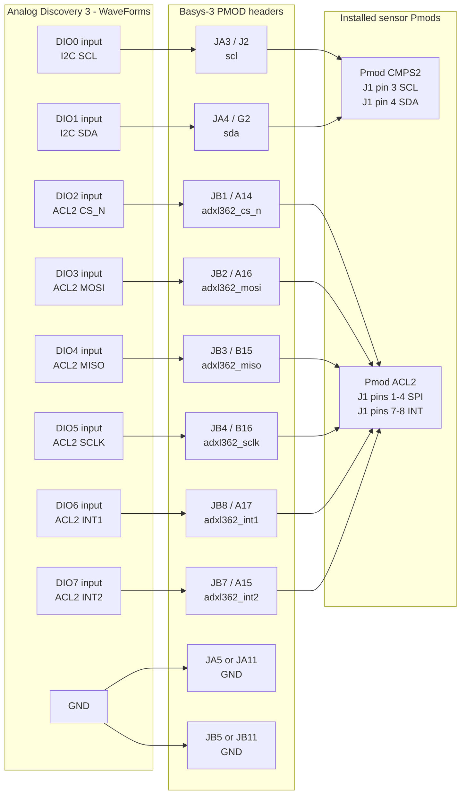

# CaelumFusion Discovery 3 to Basys-3 PMOD Wiring Guide

> Current project-wide guide: `docs/CaelumFusion_Discovery3_Basys3_Pmod_Instrumentation_Guide.md`.
> This older note is retained for historical Discovery 3 channel context and may
> not reflect the latest JA/JB/JC runtime-gated sensor mapping.

## Scope

This guide implements the bench wiring contract between a Digilent Analog
Discovery 3 running WaveForms and the Basys-3 PMOD pins used by the active
CaelumFusion RTL build.

Active project assumptions:

- Vivado project top: `caelumfusion_top_vga`.
- Active constraints: `CaelumFusion_Flight_Control.srcs/constrs_1/new/Basys-3-Master.xdc`.
- Default build is the I2C sensor build because `CAELUM_SENSOR_SPI` is not
  defined in the project file.
- `USE_ADXL362_SPI_ACC` defaults to `0`, so the ADXL362/ACL2 SPI pins are
  constrained and physically wireable, but the ADXL362 SPI acquisition engine is
  held reset until that parameter is enabled.
- The Analog Discovery 3 should be used as a passive monitor by default. Set
  all assigned DIOs to Logic Analyzer inputs before connecting them to the
  Basys-3 or to any installed Pmod.

The requested "Discovery 2 channel assignment" is treated here as the
WaveForms/Analog Discovery DIO assignment table. The AD3 uses the same DIO label
style in WaveForms.

## Reviewed Local References

| Evidence | Local path |
| --- | --- |
| Active board constraints and PMOD LOCs | `CaelumFusion_Flight_Control.srcs/constrs_1/new/Basys-3-Master.xdc` |
| Active top-level RTL ports | `CaelumFusion_Flight_Control.srcs/sources_1/new/caelumfusion_top_vga.v` |
| I2C and ADXL362 suite integration | `CaelumFusion_Flight_Control.srcs/sources_1/new/rocket_i2c_suite_top.v` |
| Open-drain I2C drive behavior | `CaelumFusion_Flight_Control.srcs/sources_1/new/i2c_master_engine.v` |
| ADXL362 SPI mode-0 behavior | `CaelumFusion_Flight_Control.srcs/sources_1/new/spi_master_engine_mode0.v` |
| Basys-3 master PMOD pin list | `Basys-3 Pmods/Basys-3-Master.txt` |
| Basys-3 PMOD electrical and pin reference | `Basys-3 Pmods/Basys 3 Reference Manual - Digilent Reference.pdf` |
| Analog Discovery 3 DIO and WaveForms limits | `Basys-3 Pmods/Analog Discovery 3 References/Analog-Discovery-3-Datasheet.pdf` |
| WaveForms startup and workspace behavior | `Basys-3 Pmods/Analog Discovery 3 References/Waveforms.rtfd/TXT.rtf` |
| WaveForms Logic Analyzer use | `Basys-3 Pmods/Analog Discovery 3 References/Logic Analyzer.rtfd/TXT.rtf` |
| WaveForms Protocol SPI/I2C decode use | `Basys-3 Pmods/Analog Discovery 3 References/Protocol.rtfd/TXT.rtf` |
| WaveForms Patterns output behavior | `Basys-3 Pmods/Analog Discovery 3 References/Digital Pattern Generator.rtfd/TXT.rtf` |
| Digilent PMOD SPI/I2C pin conventions | `Basys-3 Pmods/Use Guides/pmod-interface-specification-1_3_1.pdf` |
| Pmod ACL2 ADXL362 pinout and voltage | `Basys-3 Pmods/Pmod Reference Manuals/Pmod ACL2 Reference Manual - Digilent Reference.pdf` |
| Pmod CMPS2 MMC34160PJ pinout and pullups | `Basys-3 Pmods/Pmod Reference Manuals/Pmod CMPS2 Reference Manual - Digilent Reference.pdf` |

## Electrical Limits and Ground Reference

| Item | Required handling |
| --- | --- |
| Basys-3 PMOD logic | 3.3 V LVCMOS. Do not drive any PMOD signal above 3.4 V. |
| Basys-3 PMOD power pins | Pins 6 and 12 are 3.3 V VCC. Pins 5 and 11 are GND. These are board power pins, not FPGA pins, and do not appear in the XDC. |
| Analog Discovery 3 DIO | 3.3 V CMOS output, 5 V tolerant input. Configure DIOs as inputs for passive monitoring. |
| AD3 digital output settings | If a pre-connect output check is needed, use 3.3 V LVCMOS, 4 mA drive, slow slew, then return the DIO to input before connecting to Basys-3. |
| AD3 supplies | Leave AD3 V+ and V- disconnected unless a separate, deliberate power test calls for them. Do not back-power the Basys-3 or a Pmod from the AD3. |
| Ground | Connect AD3 GND to Basys PMOD GND before any signal leads. Use at least one short GND lead near JA/JB; use two GND leads if probing both headers. |
| I2C pullups | The RTL releases high and drives low. The XDC enables pullups on `scl` and `sda`; CMPS2 also has selectable 4.7 kohm pullups. Verify only one reasonable pullup set is active if rise time or bus current is abnormal. |

## Pin Mapping Table

Use a PMOD splitter, breadboard breakout, or short labeled fly leads. Do not
force multiple probe clips into a PMOD connector already occupied by a module.

| RTL top port | Protocol signal | Normal source | Basys PMOD pin | FPGA package pin | Pmod target pin | AD3 channel | WaveForms role | Expected idle / activity |
| --- | --- | --- | --- | --- | --- | --- | --- | --- |
| `scl` | I2C SCL | FPGA open-drain master, no clock stretching support | JA3 | J2 | CMPS2 J1 pin 3 | DIO0 | Logic input, I2C SCL | Idle high; pulses during I2C transactions |
| `sda` | I2C SDA | Bidirectional open-drain bus | JA4 | G2 | CMPS2 J1 pin 4 | DIO1 | Logic input, I2C SDA | Idle high; ACK/data low pulses |
| `adxl362_cs_n` | SPI chip select, active low | FPGA | JB1 | A14 | ACL2 J1 pin 1 | DIO2 | Logic input, SPI Select | Idle high; low during ADXL362 transaction when ADXL path is enabled |
| `adxl362_mosi` | SPI MOSI | FPGA | JB2 | A16 | ACL2 J1 pin 2 | DIO3 | Logic input, SPI DQ0/MOSI | Command/data from FPGA |
| `adxl362_miso` | SPI MISO | Pmod ACL2 / ADXL362 | JB3 | B15 | ACL2 J1 pin 3 | DIO4 | Logic input, SPI DQ1/MISO | Return data from ADXL362; may float if ACL2 is absent |
| `adxl362_sclk` | SPI SCLK | FPGA | JB4 | B16 | ACL2 J1 pin 4 | DIO5 | Logic input, SPI Clock | Idle low; 1 MHz bursts in mode 0 when ADXL path is enabled |
| `adxl362_int1` | ADXL362 INT1 | Pmod ACL2 / ADXL362 | JB8 | A17 | ACL2 J1 pin 8 | DIO6 | Logic input / counter | Data-ready active high after ADXL init when INT1 policy is used |
| `adxl362_int2` | ADXL362 INT2 | Pmod ACL2 / ADXL362 | JB7 | A15 | ACL2 J1 pin 7 | DIO7 | Logic input / counter | Expected inactive unless firmware maps an event to INT2 |
| PMOD GND | Reference | Basys-3 board | JA5/JB5/JB11 | Board ground | Sensor GND | AD3 GND | Reference | Must be common before probing |
| PMOD VCC | 3.3 V sensor rail | Basys-3 board | JA6/JB6/JB12 | Board power | Sensor VCC | Do not connect to AD3 supply | Measure only | 3.3 V nominal; disconnect if above 3.4 V |

## Signal Direction Table

Directions are from the Basys-3 FPGA design perspective.

| Signal | FPGA direction | Sensor direction | AD3 direction during normal test | Electrical discipline | Contention risk |
| --- | --- | --- | --- | --- | --- |
| `scl` | Output, open-drain drive-low/release-high | Input clock for I2C devices | Input only | Open-drain with pullup | Do not drive high from AD3. Do not use push-pull patterns on this line. |
| `sda` | Inout, open-drain | Inout | Input only | Open-drain with pullup | Highest contention risk. AD3 must be high-Z/input unless intentionally isolated. |
| `adxl362_cs_n` | Output | Input | Input only | Push-pull 3.3 V | Safe to monitor. Do not connect AD3 pattern output while FPGA drives it. |
| `adxl362_mosi` | Output | Input | Input only | Push-pull 3.3 V | Safe to monitor. |
| `adxl362_miso` | Input | Output | Input only | Push-pull/slave output when selected | If ACL2 is absent this may float. Do not drive from AD3 unless the sensor is disconnected and AD3 is intentionally emulating a slave. |
| `adxl362_sclk` | Output | Input | Input only | Push-pull 3.3 V, SPI mode 0 | Safe to monitor. |
| `adxl362_int1` | Input | Output | Input only | 3.3 V digital interrupt | Safe to monitor. Expected active-high data-ready after initialization. |
| `adxl362_int2` | Input | Output | Input only | 3.3 V digital interrupt | Safe to monitor. Usually inactive in this RTL configuration. |

## Discovery Channel Assignment Table

| AD3 lead / WaveForms channel | Connect to | Use in WaveForms | Notes |
| --- | --- | --- | --- |
| DIO0 | Basys JA3 / `scl` | Logic Analyzer channel `i2c_scl`; I2C interpreter SCL | Configure as input. |
| DIO1 | Basys JA4 / `sda` | Logic Analyzer channel `i2c_sda`; I2C interpreter SDA | Configure as input. Never push-pull drive this bus. |
| DIO2 | Basys JB1 / `adxl362_cs_n` | Logic channel `acl2_cs_n`; SPI Select active low | Trigger on falling edge for ADXL transactions. |
| DIO3 | Basys JB2 / `adxl362_mosi` | Logic channel `acl2_mosi`; SPI DQ0/MOSI | SPI decoder: MSB first, 8-bit words. |
| DIO4 | Basys JB3 / `adxl362_miso` | Logic channel `acl2_miso`; SPI DQ1/MISO | Expect PARTID `0xF2` during ADXL init read. |
| DIO5 | Basys JB4 / `adxl362_sclk` | Logic channel `acl2_sclk`; SPI Clock | SPI mode 0: CPOL 0, CPHA 0. |
| DIO6 | Basys JB8 / `adxl362_int1` | Logic channel `acl2_int1`; optional counter | Expected active-high data-ready if ADXL path and INT1 policy are enabled. |
| DIO7 | Basys JB7 / `adxl362_int2` | Logic channel `acl2_int2`; optional counter | Optional interrupt. Usually inactive. |
| GND | JA5, JB5, or JB11 | Common reference | Connect before signal wires. |
| Scope 1+ / 1- | Move as needed: SCL/GND or SCLK/GND | Analog edge/rise-time check | Optional. Do not leave scope ground floating. |
| Scope 2+ / 2- | Move as needed: SDA/GND or MOSI/GND | Analog edge/rise-time check | Optional. Use for voltage/rise-time sanity, not protocol decode. |
| W1, W2, V+, V- | No connection | Not used | Leave disconnected for this wiring unless running an isolated stimulus test. |

## PMOD Pin Assignment Tables

### Pmod JA - shared I2C sensor bus

| JA pin | FPGA package pin | RTL signal | Current use |
| --- | --- | --- | --- |
| JA1 | J1 | Not assigned in active XDC | Unused by active top |
| JA2 | L2 | Not assigned in active XDC | Unused by active top |
| JA3 | J2 | `scl` | Shared I2C SCL |
| JA4 | G2 | `sda` | Shared I2C SDA |
| JA5 | Board GND | GND | Ground reference |
| JA6 | Board 3.3 V | VCC | Sensor power |
| JA7 | H1 | Not assigned in active XDC | Unused by active top |
| JA8 | K2 | Not assigned in active XDC | Unused by active top |
| JA9 | H2 | Not assigned in active XDC | Unused by active top |
| JA10 | G3 | Not assigned in active XDC | Unused by active top |
| JA11 | Board GND | GND | Ground reference |
| JA12 | Board 3.3 V | VCC | Sensor power |

Expected I2C devices in the default build:

- Pmod CMPS2 / MMC34160PJ: `0x30`, magnetometer and heading source.
- LIS3DH auxiliary accelerometer: `0x18` or `0x19`.
- BMP585: `0x47` or `0x46`.
- PMON1 hardware is included by default and remains SW10-gated at runtime. Use
  `0x38` and do not leave it at `0x30` on the CMPS2 bus.

PMON1 shares JA SCL/SDA and therefore adds no new XDC pins. SW10 low is the
intentional unavailable/stale condition. SW10 high with PMON1 present should
produce voltage/current/status sequence updates; SW10 high with PMON1 missing
should produce invalid I2C error evidence, not stale-good power data.

### Pmod JB - Pmod ACL2 / ADXL362 SPI path

| JB pin | FPGA package pin | RTL signal | Current use |
| --- | --- | --- | --- |
| JB1 | A14 | `adxl362_cs_n` | ACL2 chip select, active low |
| JB2 | A16 | `adxl362_mosi` | ACL2 MOSI |
| JB3 | B15 | `adxl362_miso` | ACL2 MISO |
| JB4 | B16 | `adxl362_sclk` | ACL2 SCLK |
| JB5 | Board GND | GND | Ground reference |
| JB6 | Board 3.3 V | VCC | ACL2 power |
| JB7 | A15 | `adxl362_int2` | ACL2 INT2, optional |
| JB8 | A17 | `adxl362_int1` | ACL2 INT1, data-ready policy input |
| JB9 | C15 | Not assigned in active XDC | Unused by active top |
| JB10 | C16 | Not assigned in active XDC | Unused by active top |
| JB11 | Board GND | GND | Ground reference |
| JB12 | Board 3.3 V | VCC | ACL2 power |

The ADXL362 SPI path uses mode 0, 1 MHz SCLK, MSB-first 8-bit transfers. The
ADXL362 init job reads PARTID and expects `0xF2`, maps DATA_READY to active-high
INT1, leaves INT2 unmapped, and then enters measurement mode.

## Wiring Diagram



PMOD row orientation, using Digilent pin numbers:

```text
Standard 2x6 PMOD, viewed by pin number:

  1   2   3   4   5    6
  7   8   9   10  11   12

  pins 5 and 11  = GND
  pins 6 and 12  = 3.3 V VCC
```

Always confirm orientation from the Basys-3 silkscreen or a continuity check
before applying power. Pin 6 and pin 12 should both measure approximately 3.3 V
to pins 5 and 11.

## WaveForms Pre-Connection Verification

Perform this before connecting the AD3 signal leads to the Basys-3.

1. Open WaveForms and select the Analog Discovery 3 in Device Manager.
2. Start from a new workspace so no previous Pattern, Static I/O, or Protocol
   generator state can drive a line unexpectedly.
3. Confirm Supplies are off. Leave AD3 V+ and V- disconnected.
4. In Device Options or Static I/O, keep digital settings conservative:
   3.3 V LVCMOS, 4 mA drive, slow slew, no pull resistor if selectable.
5. Open Logic Analyzer and add DIO0 through DIO7 with the signal names from the
   Discovery channel assignment table.
6. Verify every assigned DIO is an input/high-Z before making a Basys
   connection.
7. If you need to identify a loose AD3 lead, test one loose lead at a time with
   Static I/O or Patterns while it is disconnected from Basys-3, then return it
   to input mode immediately.
8. Verify Basys PMOD power before signal wiring:
   - Basys powered normally.
   - AD3 GND or DMM negative on PMOD GND.
   - PMOD VCC pins 6/12 should read about 3.3 V.
   - Stop if any PMOD signal or VCC node exceeds 3.4 V.
9. Power down or hold the Basys-3 design in reset before attaching DIO leads.
10. Connect AD3 GND first, then attach DIO0-DIO7 according to the table.

## Signal-by-Signal WaveForms Checks

| Signal | WaveForms setup | Pass condition before trusting the FPGA run |
| --- | --- | --- |
| SCL / DIO0 | Logic input plus optional Scope 1+ to SCL, Scope 1- to GND | Idle high near 3.3 V. During I2C activity, clean low pulses with return to high. No AD3 output enabled. |
| SDA / DIO1 | Logic input plus optional Scope 2+ to SDA, Scope 2- to GND | Idle high near 3.3 V. ACK/data bits pull low. No push-pull high drive from AD3. |
| CS_N / DIO2 | Logic input, trigger on falling edge | Idle high. Low only during ACL2 SPI transactions. In the default build it may remain high because ADXL is disabled. |
| MOSI / DIO3 | Logic input, SPI DQ0/MOSI | Changes only during selected SPI bursts. Decoder should show ADXL362 command bytes when enabled. |
| MISO / DIO4 | Logic input, SPI DQ1/MISO | Driven by ACL2 only during selected transactions. PARTID read should return `0xF2` during init. Floating/noisy line indicates missing ACL2 or bad ground. |
| SCLK / DIO5 | Logic input, SPI clock, CPOL 0 / CPHA 0 | Idle low. Bursts at about 1 MHz when ADXL path is enabled. |
| INT1 / DIO6 | Logic input or counter | After ADXL init, data-ready should appear as active-high events if `ADXL_IRQ_POLICY` selects INT1. |
| INT2 / DIO7 | Logic input or counter | Usually inactive because the RTL job leaves INT2 unmapped. Any toggling should be explained before use. |

## Step-by-Step Bring-Up Procedure

1. Inspect the RTL/constraint contract:
   - `caelumfusion_top_vga` is the active top.
   - JA3/JA4 are `scl`/`sda`.
   - JB1/JB2/JB3/JB4/JB7/JB8 are the ADXL362/ACL2 SPI and interrupt pins.
2. Build the passive monitor harness:
   - AD3 GND to JA5 or JB5.
   - DIO0 to JA3.
   - DIO1 to JA4.
   - DIO2 to JB1.
   - DIO3 to JB2.
   - DIO4 to JB3.
   - DIO5 to JB4.
   - DIO6 to JB8.
   - DIO7 to JB7.
3. In WaveForms Logic Analyzer:
   - Use at least 5 MS/s for I2C.
   - Use at least 25 MS/s for 1 MHz SPI.
   - Name channels exactly as the signal table names.
4. Validate I2C first:
   - Add an I2C interpreter with DIO0 as SCL and DIO1 as SDA.
   - Run the default Basys build.
   - Expect idle-high SCL/SDA, START/STOP conditions, and ACKed transactions.
   - Expected 7-bit addresses are CMPS2 `0x30`, LIS3DH `0x18`/`0x19`, and
     BMP585 `0x46`/`0x47`.
5. Validate the default ADXL wiring state:
   - With `USE_ADXL362_SPI_ACC = 0`, expect `adxl362_cs_n` high and SCLK
     quiescent even though the pins are constrained.
   - If these lines toggle unexpectedly, stop and confirm the build parameters.
6. Enable and validate ADXL362/ACL2 only after the passive wiring is proven:
   - Set `USE_ADXL362_SPI_ACC` to `1` through the selected Vivado parameter
     override or source parameter change.
   - Rebuild and program the Basys-3.
   - Add a SPI interpreter: Select DIO2 active low, Clock DIO5, MOSI DIO3,
     MISO DIO4, CPOL 0, CPHA 0, MSB first, 8-bit words.
   - Trigger on CS_N falling.
   - During init, expect PARTID read data `0xF2`.
   - During sampling, expect 100 Hz transaction cadence unless interrupt-driven
     sampling changes the exact timing.
7. Validate interrupt behavior:
   - Watch DIO6 / INT1.
   - If `ADXL_IRQ_POLICY = 1`, INT1 rising events should correlate with sample
     launches after initialization.
   - DIO7 / INT2 should remain inactive unless a later RTL or sensor
     configuration explicitly maps it.
8. Save evidence:
   - Save the WaveForms workspace without acquisition for repeatable channel
     setup.
   - Save at least one I2C capture and, after ADXL enablement, one SPI capture
     with acquisition for review evidence.

## Failure Triage

| Symptom | Likely cause | Immediate check |
| --- | --- | --- |
| SCL/SDA stuck low | Reversed pin, short, unpowered Pmod, or too many pullups / bus contention | Disconnect AD3 DIOs, leave only GND, and remeasure JA3/JA4 idle voltage. |
| SCL/SDA idle high but no ACKs | Missing sensor, wrong address, wrong PMOD orientation, bad ground | Check CMPS2 power on JA6/JA5 and decode addresses. |
| SPI decoder shows no frames | ADXL path still disabled or wrong trigger/channel mapping | Confirm `USE_ADXL362_SPI_ACC = 1` and CS_N on DIO2. |
| SPI clock idles high | Wrong signal or wrong decoder mode | Verify DIO5 is JB4 and decoder is CPOL 0 / CPHA 0. |
| MISO noisy when CS_N high | Expected if ACL2 is absent or line is floating | Install ACL2, verify GND, and trigger only while CS_N is low. |
| PARTID is not `0xF2` | Wrong MISO/MOSI/SCLK/CS wiring, wrong SPI mode, unpowered ACL2 | Recheck JB pin order and WaveForms SPI mode 0 settings. |
| INT1 never toggles | ADXL not initialized, INT1 not mapped, path disabled, or policy mismatch | Confirm SPI init writes completed and `ADXL_IRQ_POLICY` uses INT1 if desired. |

## Recommended Next Development Steps

1. Build a labeled PMOD breakout harness using the DIO mapping in this document
   and keep AD3 DIOs input-only for the first run.
2. Capture and archive a baseline I2C WaveForms session for the default build.
3. Only after baseline I2C is clean, enable `USE_ADXL362_SPI_ACC`, rebuild, and
   capture the ADXL362 SPI init sequence showing PARTID `0xF2`.
4. If ADXL INT1 is part of the flight evidence contract, add a small RTL or
   documentation note that ties `ADXL_IRQ_POLICY = 1` to the physical JB8/INT1
   wiring expectation.
